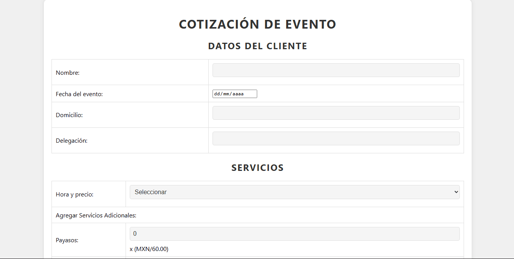

# Sistema de Cotización para Eventos

Esta actividad presenta un sistema de cotización de eventos, diseñado para recopilar datos del cliente y calcular el costo total de un evento basado en diversos servicios seleccionados. La aplicación utiliza HTML y CSS para la estructura y el diseño, y PHP para el procesamiento de datos. Este proyecto muestra habilidades en la creación de formularios web, interacción con el usuario y cálculos dinámicos del lado del servidor.

  

El sistema permite al usuario:

- **Ingresar Datos del Cliente:** Incluye nombre, fecha del evento, domicilio y delegación.

- **Seleccionar Servicios Adicionales:** Como payasos, muñecos, bailarinas, magos, decoración y grabación de la fiesta.

- **Calcular el Costo Total:** Basado en los servicios seleccionados y la delegación del evento.

Esta actividad destaca la capacidad de crear aplicaciones web interactivas y útiles para la gestión de eventos, demostrando competencia en diseño front-end y procesamiento de datos en el back-end.

**Consulta la versión preliminar de la actividad aquí:** [https://ejercicio_11.com](https://alejandrovillegas.net/projects/exercise-11/index.php)

# 📌 Información de la Actividad

Esta actividad ha sido desarrollado como parte del portafolio de soluciones tecnológicas, con el objetivo de ofrecer una herramienta eficiente y funcional para usuarios autodidactas interesados en la gestión y desarrollo de proyectos web.

- **Área**: Desarrollo de Actividades Web

- **Usuario Final**: TecNM

- **Fecha de Desarrollo**: 14 de noviembre de 2018

- **Portafolio de Proyectos**: [www.alejandrovillegas.net](https://www.alejandrovillegas.net/)

## 🔧 Guía de Instalación y Configuración de la Actividad

1. Descargue y descomprima el archivo del proyecto en su sistema local.

La actividad ahora está funcionando en su entorno local. 🎉
